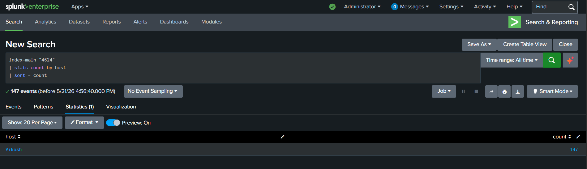
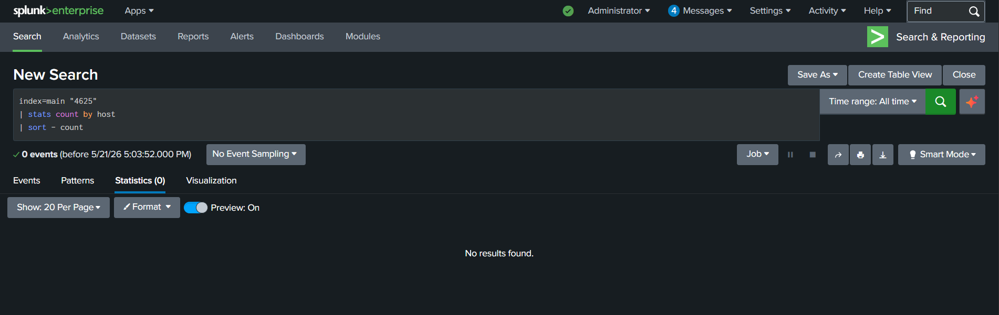
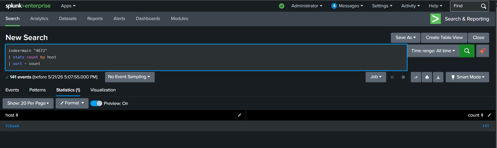
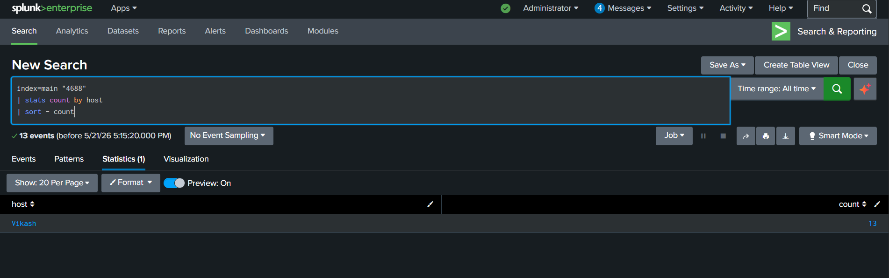
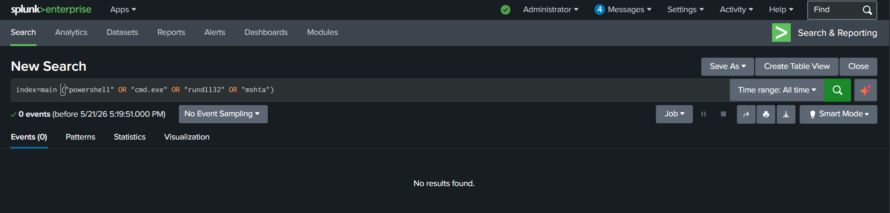
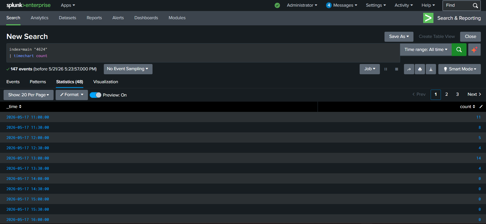
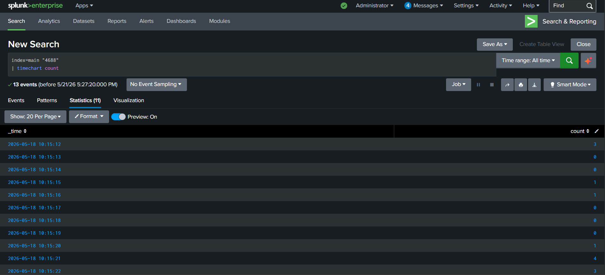

# MITRE ATT&CK Mapped Incident Report

## Overview

- This project demonstrates a SOC investigation and incident reporting workflow using:

  - Splunk SIEM
  - Windows Security Event Logs
  - MITRE ATT&CK mapping
  - Detection engineering concepts
  - Threat hunting methodology
  - Incident response documentation

- The project simulates how SOC analysts investigate suspicious activity, correlate detections, build attack timelines, and document findings professionally.

---

## Objectives

### Primary Goal

- Investigate suspicious activity and create a professionally structured SOC incident report aligned with MITRE ATT&CK techniques.

---

## Investigation Focus Areas

- This project investigates:

  - Authentication activity
  - Failed and successful logons
  - Privileged account usage
  - Process creation events
  - Suspicious command execution
  - Potential attacker behavior
  - Threat hunting findings

---

## Technologies Used

| Technology | Purpose |
|---|---|
| Splunk Free | SIEM platform |
| Windows Security Logs | Event telemetry |
| SPL | Investigation queries |
| MITRE ATT&CK | Threat mapping |
| Sigma Concepts | Detection methodology |

---

## MITRE ATT&CK Mapping

| Technique | ID | Tactic |
|---|---|---|
| Brute Force | T1110 | Credential Access |
| Valid Accounts | T1078 | Defense Evasion |
| PowerShell | T1059.001 | Execution |
| Signed Binary Proxy Execution | T1218 | Defense Evasion |

---

## Event IDs Investigated

| Event ID | Description |
|---|---|
| 4624 | Successful Logon |
| 4625 | Failed Logon |
| 4672 | Privileged Logon |
| 4688 | Process Creation |

---

## Example Investigation Query

```spl
index=main "4688"
| stats count by host
| sort - count
````

---

## Investigation Methodology

- The investigation process included:

  1. Reviewing authentication activity
  2. Monitoring privileged access
  3. Hunting suspicious process execution
  4. Correlating Windows events
  5. Mapping findings to MITRE ATT&CK
  6. Building an incident timeline
  7. Writing analyst assessments

---

## Detection Engineering Concepts

- This project explores:

  * Threat hunting
  * Incident investigation
  * Event correlation
  * ATT&CK-based analysis
  * SOC reporting workflows
  * Detection logic development

---

## SOC Skills Demonstrated

* Splunk investigation workflows
* Windows event analysis
* ATT&CK mapping
* Incident reporting
* Threat hunting
* Authentication monitoring
* Process analysis
* SOC analytical documentation

---

## False Positive Considerations

- Potential benign explanations reviewed during investigation:

  * Normal Windows startup activity
  * Service account activity
  * Administrative logons
  * Legitimate PowerShell usage
  * System-generated processes

---

## Future Improvements

- Potential future enhancements include:

  * Sysmon integration
  * Timeline visualization
  * Threat intelligence enrichment
  * Alert automation
  * KQL/Sentinel migration
  * IOC enrichment

---

## Project Status

- Active SOC investigation and ATT&CK mapping learning project focused on incident reporting and analytical workflows.

---

## Screenshots

### Successful Authentication Analysis



---

### Failed Authentication Monitoring



---

### Privileged Logon Monitoring



---

### Process Creation Investigation



---

### Suspicious PowerShell Hunting



---

### Authentication Timeline Analysis



---

### Process Activity Timeline


